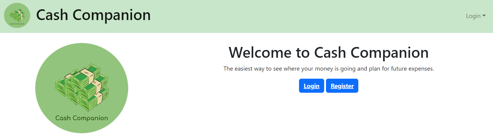
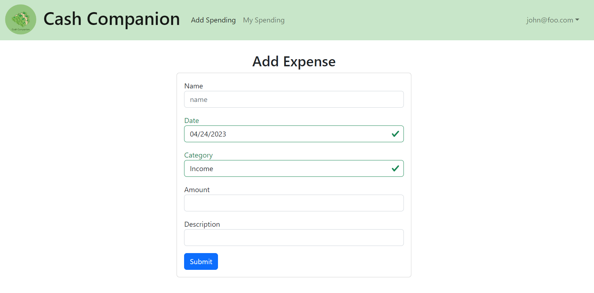
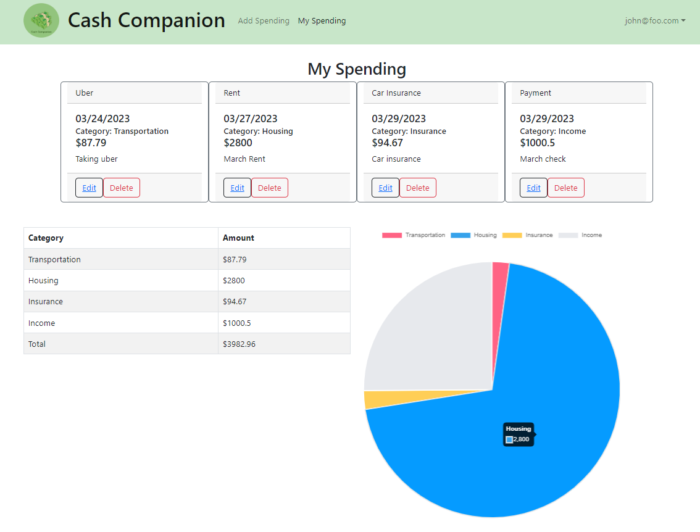
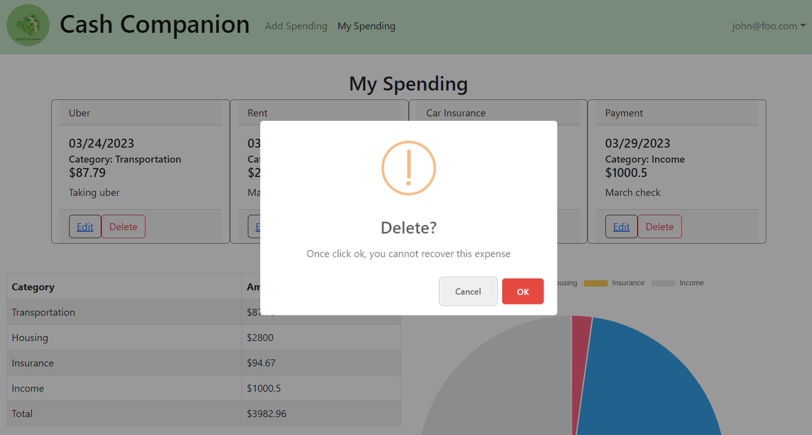
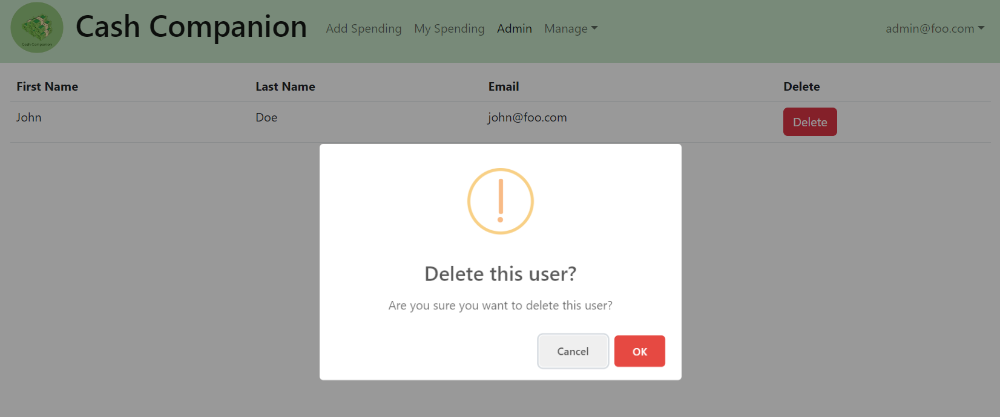

# Kim Cathy Sojung의 포트폴리오

## 1. SimGrid XML 플랫폼 설명 파일 시각화

### :exclamation: 소개
> SimGrid는 분산 컴퓨팅 시스템을 시뮬레이션하기 위한 프레임워크입니다. 분산 시스템의 성능을 평가하고 디버그하며 프로파일링하는 데 사용할 수 있는 시뮬레이션 툴입니다. 하지만 많은 이용자들은 1000+ 줄이 넘는 XML 파일의 경우, 읽고 문제를 해결하거나 수정하는 데에 어려움을 겪습니다. 그래서 저와 제 팀원은 브라우저 내에서 쉽게 XML 파일을 시각화 할 수 있는 웹어플리케이션을 개발하였습니다. 이 어플리케이션은 JavaScript로 작성되었으며, 사용자가 SimGrid XML 플랫폼 설명 파일을 시각화, 수정, 내보내기 및 생성할 수 있게끔 개발되었습니다.

 

### :sunny: 구현

- 우측의 XML 파일을 로드해 그래프를 구현
- 각 노드와 간선을 눌렀을 때 하단의 팝업으로 property를 수정할 수 있게 구현
- 수정된 파일을 다운로드 할 수 있게 구현

 

### :scroll: 기술스택
- Cytoscape
- JavaScript
- React.js
- Material UI
- CSS

 

### :bulb: 프로젝트 기여도
> 이 프로젝트는 한 명의 다른 팀원과 함께 진행했으며, 각각 50%씩 기여했습니다. 둘이 함께 FE와 BE를 같이 작업하였습니다.

 

#### :pushpin: 개인기여도
- `useState`를 사용하여 요소를 처리하고, 팝업을 만들어 수정/저장할 수 있게 구현
- `useEffect`와 같은 React 훅을 사용
- `handleElements`로 맵을 사용하여 현재 웹사이트에 표시된 요소를 내보낼 수 있도록 구현
- `iterate`을 사용해 XML 파일을 로드한 후 노드를 연결하고 웹사이트에 그래프를 시각화

 

### :sparkles: 습득한 역량

##### 기술적 어려움

- *Cytoscape 사용법 익히기*: Cytoscape를 처음 사용하여 그래프를 시각화하고 배열하는 데 어려움을 겪었습니다.
- *브라우저 및 운영 체제 호환 문제*: 다양한 브라우저 및 운영 체제에서 그래프가 제대로 표시되지 않는 호환 문제에 직면했습니다.

##### 극복 과정

- *온라인 자료 활용*: Cytoscape 공식 문서, 온라인 튜토리얼, 커뮤니티 포럼 등을 활용하여 문제 해결에 필요한 정보를 얻었습니다.
- *끈기 있는 노력*: 꾸준히 노력하고 시행착오를 반복하면서 Cytoscape 사용법을 숙달하고 호환 문제를 해결했습니다.

##### 결과
- *성공적인 그래프 시각화 및 배열*: Cytoscape를 사용하여 복잡한 데이터를 시각적으로 표현하고 이해하기 쉽게 배열하는 데 성공했습니다.
- *문제 해결 능력 향상*: 예상치 못한 기술적 어려움에 직면했을 때도 끈기 있게 노력하고 팀원과 협력하여 문제를 해결하는 능력을 향상시켰습니다.

 

### :bookmark: 코드 및 URL
- [코드](https://github.com/wrench-project/simgrid-platform-file-visualizer)
- [프로젝트 포스터 (영문)](sources/SimGrid_poster.png)

 
 
 
 
 
   

## 2. Ala Hele (하와이 교육청 입법 절차 지원 웹사이트)

### :exclamation: 소개
> 6명의 다른 팀원들과 함께 하와이 교육청의 주 의회 절차 간소화를 돕기 위해 Meteor 프레임워크와 JavaScript를 사용하여 웹사이트를 개발했습니다. 이 웹사이트는 입법 추적, 자동 알림, 효율적인 문서 생성 및 업데이트 기능을 제공하게끔 개발되었고 이와같은 기능을 제공하여 주 의회 통과를 촉진하는 도구를 제공할 수 있었습니다.

 

### :sunny: 구현

#### 랜딩 페이지

- 사용자가 쉽게 로그인 및 정보를 볼 수 있게 구현

#### Bill (법안) 리스트 페이지

- 수많은 Bill 항목을 검색 및 필터링 할 수 있게 구현

#### Testimony (증언) 생성 페이지

- 손쉽게 Testimony 를 생성하고 각 부서로 지정 할 수 있게 구현

#### 개별 Hearing (심의자료) 페이지

- 리얼타임으로 Hearing의 심의기간을 확인 할 수 있게 구현
- ROUTE FOR OFFICE REVIEW / ROUTE TO PIPE 버튼으로 내보내기 구현

#### 개별 Testimony 페이지

- 불러온 Testimony 를 PDF로 저장 할 수 있게 구현

 

### :scroll: 기술스택
- Mongo DB
- Meteor
- JavaScript
- React.js
- Bootstrap
- CSS

 

### :bulb: 프로젝트 기여도
> 이 프로젝트는 6명의 다른 팀원과 함께 진행했습니다. FE와 BE 나누기 없이 모두 함께 FE와 BE를 담당했습니다. 저의 기여도는 30% 이상이였습니다.

#### :pushpin: 개인기여도
- `BaseCollection` 를 사용하여 입법 청문회에 대한 정보를 연도, 법안 번호, 법안 유형, 날짜/시간, 등등으로 컬렉션으로 저장
- 각 Bill, Testimony, Hearing 리스트에서 페이지네이션 구현
- `useState`과 `useTracker` 를 사용하여 서치바로 법안 검색 기능 및 정렬 기능 구현
- 사용자가 따로 클릭한 법안을 즐겨찾기 할 수 있도록 구현
- `MongoDB` 를 통해 데이터를 저장 및 사용자가 직접 웹사이트에서 계정을 만들 수 있도록 구현

 

### :sparkles: 습득한 역량

##### 기술적 어려움

- *팀원과의 소통 부족*: 처음에는 팀원들과 서로 다른 작업 방식으로 인해 의견 통합이 어려웠습니다. 
- *대규모 팀워크 부담*: 한 번에 많은 팀원들과 협업하는 데 어려움을 겪었습니다. 
- *페이지네이션 구현 버그*: 페이지네이션 기능 구현 과정에서 버그 발생으로 어려움을 겪었습니다.

##### 극복 과정

- *지속적인 협력*: 시간이 지나면서 팀원들과 꾸준히 소통하고 협력하려는 노력을 통해 의견 통합을 개선했습니다.
- *적응과 성장*: 대규모 팀워크에 적응하고 효과적인 협업 방식을 익혔습니다.
- *문제 해결 능력*: 검색, 조사, 팀원과의 협력을 통해 페이지네이션 구현 과정에서 발생한 버그를 해결했습니다.

##### 결과
- *효과적인 팀워크*: 팀원들과의 소통과 협력 능력을 향상시켜 효과적으로 협업할 수 있게 되었습니다.
- *대규모 프로젝트 수행 능력*: 대규모 팀 프로젝트를 성공적으로 수행할 수 있는 능력을 키웠습니다.
- *문제 해결 능력 향상*: 문제 발생 시 스스로 해결책을 찾고 팀원들과 협력하여 해결하는 능력을 향상시켰습니다.

### :bookmark: 코드 및 URL
- [코드](https://github.com/alahele/alahele)
- [프로젝트 설명사이트 (영문)](https://alahele.github.io/)

 
 
 
 
 
   

## 3. Cash Companion

### :exclamation: 소개
> Cash Companion는 예산 추적기와 유사한, 사용자의 지출을 관리할 수 있는 웹어플리케이션입니다. 사용자가 지출 내역을 입력하면 이 웹은 사용자 재정에 대한 월별 통계 자료를 계산합니다. 또한 이 웹은 예산 설정 및 분류별 정렬 기능도 제공합니다.

 

### :sunny: 구현

#### 랜딩 페이지

- 사용자가 랜딩 페이지에서 바로 로그인 및 회원가입을 할 수 있게 구현

#### 지출 입력 페이지

- 사용자가 이름, 날짜, 카테고리, 금액 및 설명을 추가할 수 있는 기능을 구현

#### 지출 목록 페이지 

- 지출 목록 페이지에서 활성 계정과 관련된 모든 지출을 사용자가 볼 수 있게 구현
- 지출 추가, 편집 또는 삭제할 수 있는 기능을 구현
- 각 지출 카테고리별로 총 지출액이 자동으로 계산되어 표시 및 해당 금액에 해당하는 파이 차트 표시 기능

#### 지출 삭제 팝업

#### 사용자 삭제 페이지

- 관리자 계정은 사용자 계정을 삭제할 수 있게 구현

 

### :scroll: 기술스택
- JavaScript
- React
- chart.js
- Meteor
- MongoDB
- HTML
- CSS

 

### :bulb: 프로젝트 기여도
> 이 프로젝트는 혼자서 웹사이트 제작 및 다큐멘트와 WIKI를 작성하였습니다.

#### :pushpin: 개인기여도
- `chart.js` 를 사용하여 파이 차트 제작
- `useEffect` 와 `useTracker` 같은 React 훅을 사용
- `baseCollection`으로 사용자 가입 / 관리자가 사용자 삭제 같은 기능을 구현
- `bootstrap` 으로 사용자가 편하게 쓸 수 있는 UI를 구현

 

### :sparkles: 습득한 역량

##### 기술적 어려움

- *팀원과의 협력*: 본래 이 프로젝트는 3명의 다른 팀원과 함께 진행하는 프로젝트였으나, 팀원들이 프로젝트에 기여하지 않아 혼자 모든 작업을 수행해야 했습니다.
- *chart.js 사용법 익히기*: 차트 구현이 처음이라 파이 차트를 구현하는 데 어려움을 겪었습니다.
- *다큐멘트 및 WIKI 작성*: 처음으로 개발하는 도구에 대해 다큐멘트와 WIKI를 작성해야 했기에, 어떻게 작성해야 할지 막막했습니다.

##### 극복 과정

- *홀로서기*: 항상 팀과 함께 어플리케이션이나 웹사이트를 만들었지만, 이번에는 혼자서 프로젝트를 진행하기로 결정했습니다. 제 페이스에 맞춰 천천히 공부하면서 사이트를 구축하기 시작했습니다.
- *온라인 자료 활용*: Chart.js의 공식 문서, 온라인 샘플, 커뮤니티 포럼 등을 활용하여 필요한 정보를 얻고 문제를 해결했습니다.
- *끈기 있는 노력*: 꾸준한 노력과 시행착오를 반복하며, 깔끔하고 자세한 다큐멘트와 WIKI를 작성할 수 있었습니다.

##### 결과
- *독립적 업무 수행 능력 향상*: 프로젝트를 진행하면서 독립적으로 다큐멘트와 WIKI를 작성하고 차트를 구현하는 등 모든 업무를 수행함으로써, 독립적으로 업무를 처리하는 능력이 크게 향상되었습니다. 프로젝트의 모든 과정을 혼자서 관리하고 진행하면서 전반적인 이해도가 높아지고, 자율적으로 업무를 수행할 수 있는 능력이 강화되었습니다.

### :bookmark: 코드 및 URL
- [코드](https://github.com/Cash-Companion/Cash-Companion)
- [프로젝트 다큐멘트 (영문)](https://github.com/Cash-Companion/Cash-Companion/blob/main/doc/Document.pdf)
- [프로젝트 WIKI (영문)](https://github.com/Cash-Companion/Cash-Companion/wiki)
