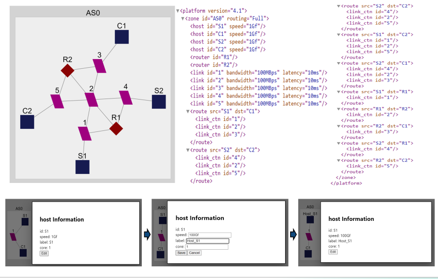
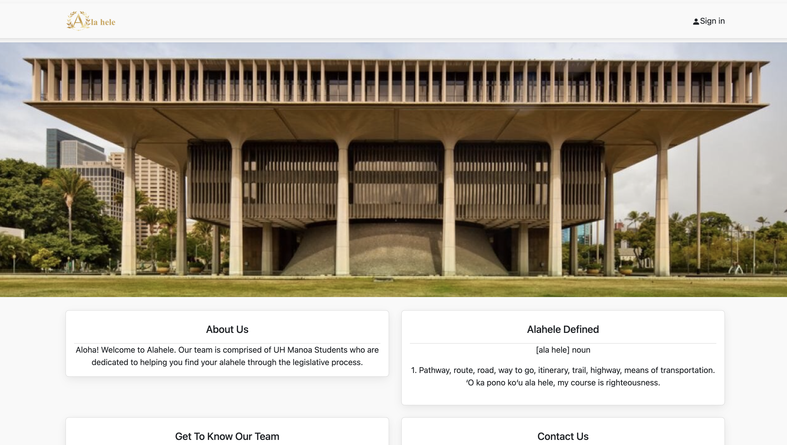
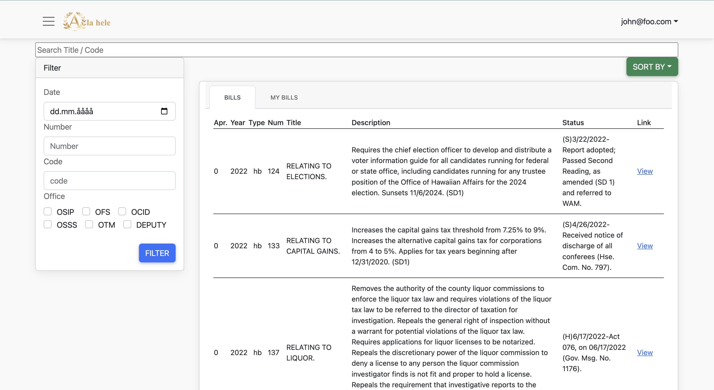
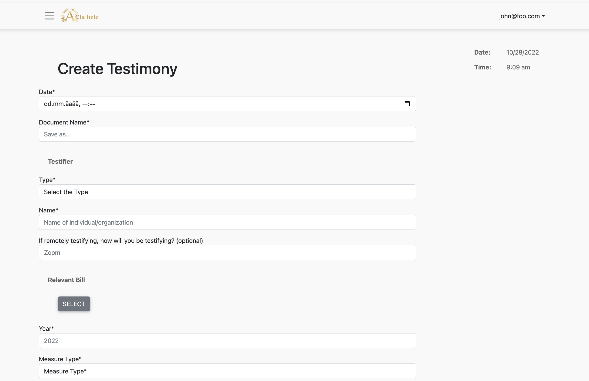
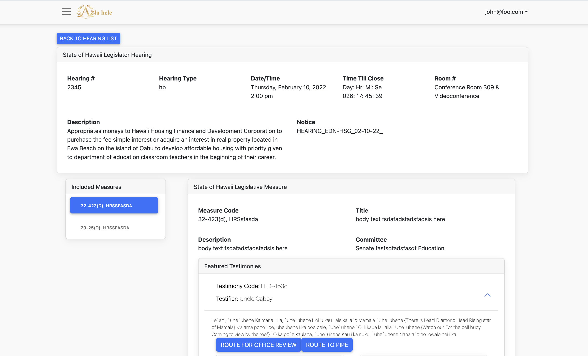
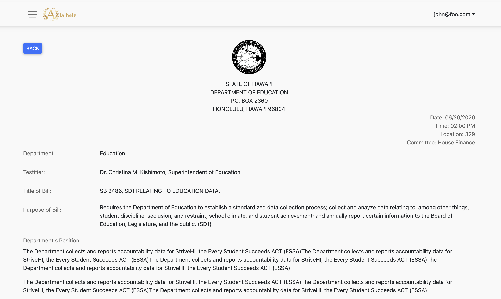

# Kim Cathy Sojung 포트폴리오

## SimGrid XML 플랫폼 설명 파일 시각화

### :exclamation: 소개
> SimGrid는 해외에서 쓰는 시뮬레이션 툴킷입니다. 사용자가 시뮬레이션 할 XML 파일을 입력할 수 있게 해주지만, 많은 이용자들은 1000 줄이 넘는 XML 파일 자체를 읽고, 문제를 해결하며, 수정하는 데에 어려움이 있었습니다. 그래서 저와 제 팀원은 브라우저 내에서 쉽게 XML 파일을 시각화 할 수 있는 웹어플리케이션을 개발하였습니다. 이 어플리케이션은 JavaScript로 작성되었으며, 사용자가 SimGrid XML 플랫폼 설명 파일을 시각화, 수정, 내보내기 및 생성할 수 있게끔 개발되었습니다.

### :sunny: 구현

- 우측의 XML 파일을 로드해 그래프를 구현
- 각 노드를 눌렀을 때 하단의 팝업으로 property를 수정할 수 있게 구현

### :scroll: 기술스택
- Cytoscape
- JavaScript
- React.js
- Material UI

### :bulb: 프로젝트 기여도
> 이 프로젝트는 한 명의 다른 팀원과 함께 진행했으며, 각각 50%씩 기여했습니다. 둘이 함께 FE와 BE를 같이 작업하였습니다.

#### :pushpin: 개인기여도
- `useState` 를 사용하여 요소를 처리하고, 팝업을 만들어 수정/저장할 수 있게 구현
- `useEffect` 와 같은 React 훅을 사용
- `handleElements`로 맵을 사용하여 현재 웹사이트에 표시된 요소를 내보낼 수 있도록 구현
- `iterateJson` 로 XML 파일을 로드해 노드를 연결하고 웹사이트에 그래프를 시각화

### :sparkles: 습득한 역량
- 기술적 어려움: Cytoscape 사용법 익히기, 브라우저 및 운영 체제 호환 문제 해결
- 극복 과정: 팀원과 협력, 온라인 자료 활용, 끈기 있는 노력
- 결과: 성공적인 그래프 시각화 및 배열, 문제 해결 능력 향상, 팀워크 강화

### :bookmark: 코드 및 URL
- [코드](https://github.com/wrench-project/simgrid-platform-file-visualizer)
- [프로젝트 포스터](sources/SimGrid_poster.png)

## Ala Hele (하와이 교육청 입법 절차 지원 웹사이트)

### :exclamation: 소개
> 6명의 다른 팀원들과 함께 하와이 교육청의 주 의회 절차 간소화를 돕기 위해 Meteor 프레임워크와 JavaScript를 사용하여 견고한 웹사이트를 개발했습니다. 이 웹사이트는 입법 추적, 자동 알림, 효율적인 문서 생성 및 업데이트 기능을 제공하게끔 개발되었고 이와같은 기능을 제공하여 주 의회 통과를 촉진하는 도구를 제공할 수 있었습니다.

### :sunny: 구현

#### 랜딩 페이지

- 사용자가 쉽게 로그인 및 정보를 볼 수 있게 구현

#### Bill (법안) 리스트 페이지

- 수많은 Bill 항목을 검색 및 필터링 할 수 있게 구현

#### Testimony (증언) 생성 페이지

- 손쉽게 Testimony 를 생성하고 각 부서로 지정 할 수 있게 구현

#### 개별 Hearing (심의자료) 페이지

- 불러온 Hearing 을 보고 저장 할 수 있게 구현

#### 개별 Testimony 페이지

- 리얼타임으로 Hearing의 심의기간을 확인 할 수 있게 구현
- ROUTE PIPE / ROUTE OFFICE REVIEW 버튼으로 메일로 내보내기 구현

### :scroll: 기술스택
- Mongo DB
- Meteor
- JavaScript
- React.js

### :bulb: 프로젝트 기여도
> 이 프로젝트는 6명의 다른 팀원과 함께 진행했습니다. FE와 BE 나누기 없이 모두 함께 FE와 BE를 담당했습니다. 저의 기여도는 30% 이상이였습니다.

#### :pushpin: 개인기여도
- `BaseCollection` 를 사용하여 입법 청문회에 대한 정보를 연도, 법안 번호, 법안 유형, 날짜/시간, 등등으로 컬렉션으로 저장
- 각 Bill, Testimony, Hearing 리스트에서 페이지네이션 구현
- `useState`과 `useTracker` 로 서치바로 법안 검색 기능 및 정렬 기능 구현
- 사용자가 따로 클릭한 법안을 즐겨찾기 할 수 있도록 구현
- `MongoDB` 를 통해 사용자가 직접 웹사이트에서 계정을 만들 수 있도록 구현

### :sparkles: 습득한 역량

##### 기술적 어려움

- *팀원과의 소통 부족*: 처음에는 팀원들과 서로 다른 작업 방식으로 인해 의견 통합이 어려웠습니다. 
- *대규모 팀워크 부담*: 한 번에 많은 팀원들과 협업하는 데 어려움을 겪었습니다. 
- *페이지네이션 구현 버그*: 페이지네이션 기능 구현 과정에서 버그 발생으로 어려움을 겪었습니다.
- 
##### 극복 과정

- *지속적인 협력*: 시간이 지나면서 팀원들과 꾸준히 소통하고 협력하려는 노력을 통해 의견 통합을 개선했습니다.
- *적응과 성장*: 대규모 팀워크에 적응하고 효과적인 협업 방식을 익혔습니다.
- *문제 해결 능력*: 검색, 조사, 팀원과의 협력을 통해 페이지네이션 구현 과정에서 발생한 버그를 해결했습니다.

##### 결과
- *효과적인 팀워크*: 팀원들과의 소통과 협력 능력을 향상시켜 효과적으로 협업할 수 있게 되었습니다.
- *대규모 프로젝트 수행 능력*: 대규모 팀 프로젝트를 성공적으로 수행할 수 있는 능력을 키웠습니다.
- *문제 해결 능력 향상*: 문제 발생 시 스스로 해결책을 찾고 팀원들과 협력하여 해결하는 능력을 향상시켰습니다.

### :bookmark: 코드 및 URL
- [코드](https://github.com/alahele/alahele)
- [프로젝트 설명사이트](https://alahele.github.io/)
## Career Match
